# VERQESTRA UI auditas — 2026-08-24 (3-ias dabartinės versijos pjūvis)

## Audito apimtis

**Bendra būklė: 🟡/🟢 7,6/10.** Pagrindiniai ekranai stabilūs, mobilus reflow veikia, sistemos būsenos tapo tikslesnės, o politikų valdymo forma aiškiai paženklinta. P0 blokatorių nerasta. Didžiausios likusios rizikos susijusios ne su maketu, o su duomenų patikimumu sprendimų ir analitikos ekranuose bei vienu klaviatūros fokusavimo tašku.

Tikrintas dabartinis vietinis build'as 1440 × 1000 ir 390 × 844 viewport'uose. Būsena audito metu: ciklas sustabdytas, 13 užduočių eilėje, 3 politikų pakeitimai reikalauja veiksmo, 4 telemetrijos įrašai. Ciklas nebuvo paleistas, failai nebuvo įkelti, politikos nebuvo patvirtintos, atmestos ar išsiųstos.

## Patvirtintos stiprybės

- „Ryšys gyvas“ aiškiai apibūdintas kaip realaus laiko kanalas, o sistemos antraštė sako „Valdymo sąsaja pasiekiama“ — ryšys, UI ir automatikos būsena nebemaišomi.
- Mobilioji lipni antraštė yra 60 px aukščio, t. y. 7,1 % 844 px viewport'o, ir palieka daug daugiau vietos turiniui.
- Tuščia žmogaus peržiūros būsena kompaktiška; politikų paieška ir pirmos kortelės matomos tame pačiame ekrane.
- Politikos forma turi matomas etiketes, privalomumo žymą ir tekstinį paaiškinimą, kodėl „Siųsti“ išjungtas.
- Užduočių lenta siaurame ekrane persirikiuoja į vieną stulpelį, o mobilus „Daugiau“ meniu pasiekia visus ekranus ir įrankius.
- Tikrintuose perėjimuose naršyklės konsolėje klaidų ir įspėjimų neužfiksuota.

## Aukščiausio prioriteto rizikos

### P1 — Sprendimų skaičiai nėra savaime paaiškinami

Politikų suvestinė rodo „2 laukia sprendimo“, o sprendimų eilė — „3 reikalauja veiksmo“. Eilėje yra du atskiri `open_closed` pasiūlymai su ta pačia kryptimi `advisory → block`, bet skirtingomis priežastimis.

**Poveikis:** operatorius negali iš ekrano suprasti, ar tai du unikalūs nustatymai ir trys užklausos, ar duomenų neatitikimas. Pasikartojantį pasiūlymą galima peržiūrėti ar patvirtinti du kartus negaunant konflikto perspėjimo.

**Rekomendacija:** pervadinti skaičius į „2 unikalios politikos / 3 pasiūlymai“, grupuoti pasiūlymus pagal politikos ID ir pažymėti pasikartojančius ar konfliktuojančius prašymus.

### P1 — Tuščias užduoties ID iškreipia analitikos santrauką

Analitika rodo „2 unikalios užduotys“ ir vidurkį 176 298 tokenų, nors lentelėje yra viena pavadinta užduotis su 352 595 tokenais ir antra visiškai tuščia eilutė su 0 tokenų. Tuščia eilutė matomai dalijasi iš vidurkio vardiklio.

**Poveikis:** pagrindinė efektyvumo metrika atrodo tiksli, bet yra klaidinanti; tai mažina pasitikėjimą visomis suvestinės išvadomis.

**Rekomendacija:** tuščią ID normalizuoti į „Be užduoties ID“ ir atskirti nuo užduočių KPI arba neįtraukti į unikalių užduočių bei vidurkio skaičiavimą, kai tokenų suma lygi nuliui.

### P1 — Nematomam failo laukui paliktas klaviatūros fokusas

Mobilioje užduočių lentoje `input[type=file]` yra 1 × 1 px, `opacity: 0`, absoliučiai pozicionuotas, bet `tabIndex = 0`. Šalia jau yra matomas mygtukas „Pasirinkti“.

**Poveikis:** klaviatūros naudotojas gali patekti į nematomą arba dubliuotą fokusavimo sustojimą ir nesuprasti, kuris veiksmas aktyvus.

**Rekomendacija:** palikti vieną semantiškai aktyvų valdiklį. Jei tikras input'as lieka fokusavimo grandinėje, matomas label'is turi gauti aiškų `:focus-within` kontūrą ir neturi būti antro dubliuojančio mygtuko.

## Kitos rizikos

### P2 — Užduočių pavadinimai ir stulpeliai lieka mišrios kalbos

Lietuviškame UI stulpeliai rodomi kaip `QUEUE`, `ACTIVE`, `DELEGATED`, `ERROR`, `FAILED`, `HUMAN-REVIEW`, o failo slug'ų tekstuose dingsta lietuviški simboliai: „i tirti“, „para yti“, „u daryti“.

**Rekomendacija:** lokalizuoti rodomas būsenas ir naudoti užduoties antraštę iš Markdown metaduomenų ar turinio, ne iš nuvalyto failo pavadinimo.

### P2 — Analitikos lokalizacija nėra nuosekli

Lietuviškame ekrane datos laukų formatas rodomas `mm/dd/yyyy`, dalis paaiškinimų prieinamumo medyje lieka angliški, o santraukoje maišomi „tokenai“ ir „tokens“.

**Rekomendacija:** LT režime naudoti lokalų datos formatą ir lokalizuoti matomą bei prieinamą pagalbinį tekstą.

### P2 — Mobilus meniu vis dar labai aukštas

Kompaktiška 60 px antraštė yra gera, tačiau atidarytas „Daugiau“ meniu užima didžiąją ekrano dalį ir turi vidinę slinktį. Žemiau esantys „Įrankiai“ gali likti už matomos ribos.

**Rekomendacija:** grupuoti ekranus į 2 stulpelių tinklelį arba atskirti dažnus ekranus nuo retesnių administravimo nuorodų.

### P3 — Apžvalgos signalų tinklelis turi našlaitę kortelę

Darbalaukyje penkios signalų kortelės telpa pirmoje eilėje, o „Stabilus commit'as“ lieka viena antroje eilėje. Tai sukuria didelį tuščią plotą ir silpnina hierarchiją.

**Rekomendacija:** naudoti 3 + 3 tinklelį arba mažesnę adaptuojamą minimalią kortelės plotį.

## Ekranų eiga

### 1. Apžvalga — 🟡/🟢

Būsenos formuluotė tikslesnė, bet signalų tinklelis dar nebalansuotas.

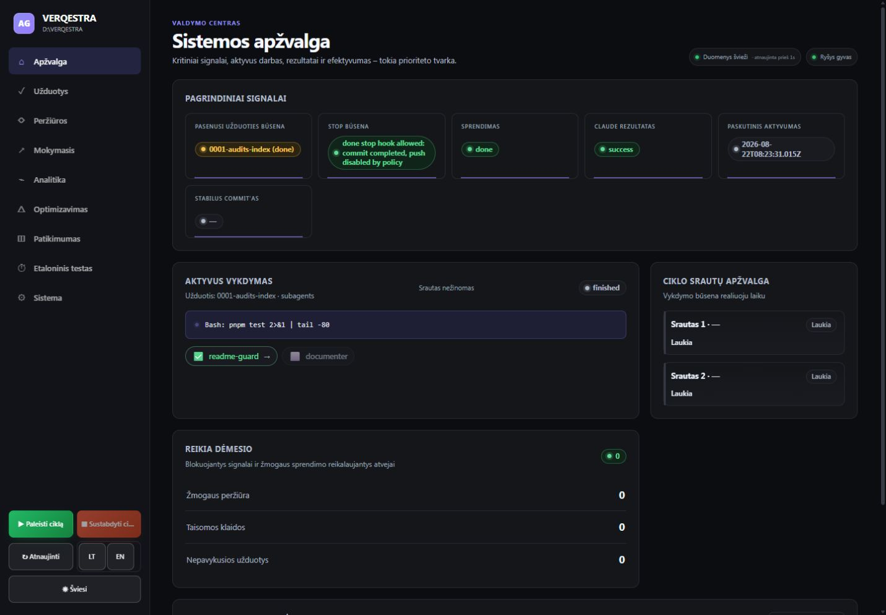

### 2. Užduotys — 🟡

Visa darbo eiga telpa viename darbalaukio ekrane; pagrindinė likusi problema — siauri, trumpinami pavadinimai ir mišri lokalizacija.

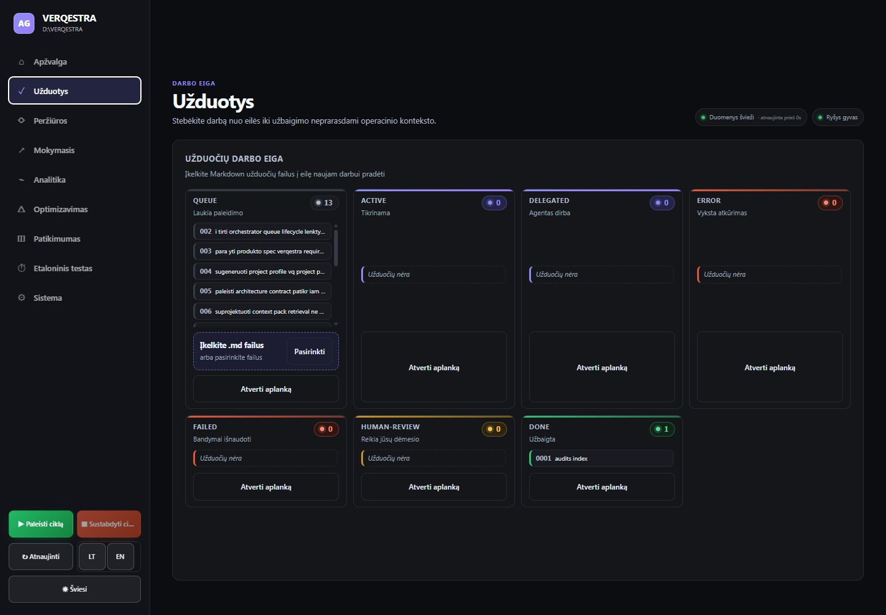

### 3. Peržiūrų pradžia — 🟢

Tuščia žmogaus peržiūros būsena kompaktiška, politikų kontrolės matomos be papildomo slinkimo.

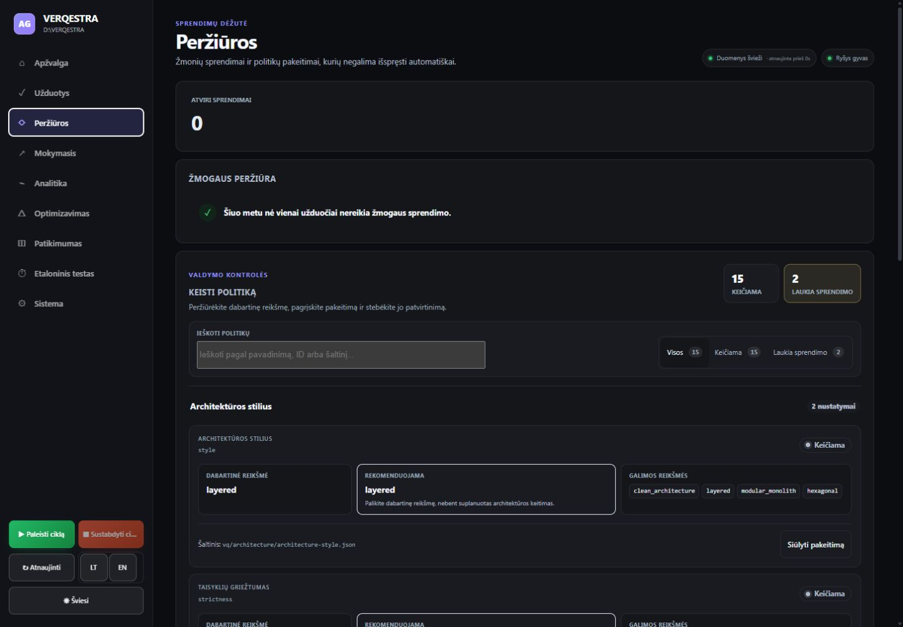

### 4. Sprendimų eilė — 🟠

Kortelės aiškiai rodo dabartinę ir siūlomą reikšmę, tačiau 2 ir 3 skaičių neatitikimas bei du `open_closed` pasiūlymai reikalauja grupavimo.

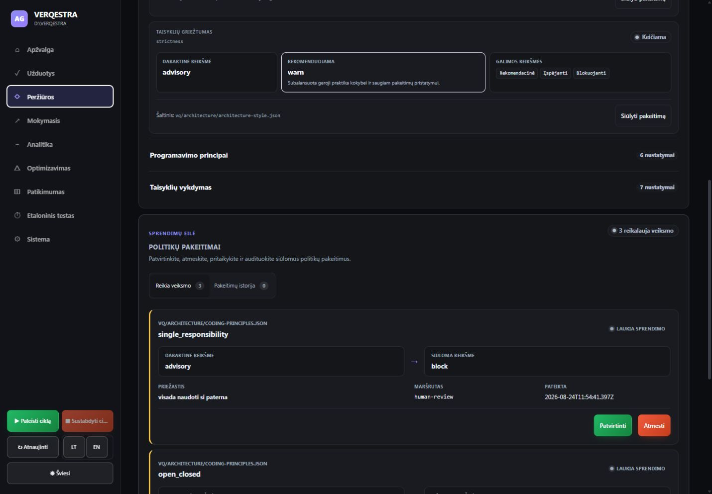

### 5. Politikos forma — 🟢

Etiketės ir išjungto veiksmo paaiškinimas aiškūs. Likutinė smulki rizika — pradinė santrauka rodo no-op `layered → layered`.

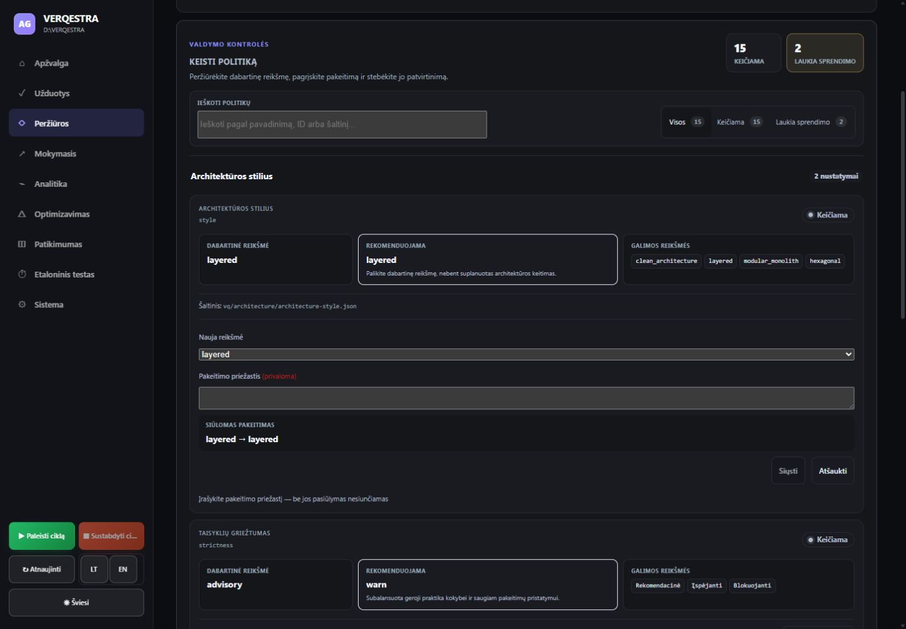

### 6. Sistema — 🟢

Sąsajos pasiekiamumas, sustabdytas ciklas ir automatikos dėmesio signalas dabar atskirti aiškiai.

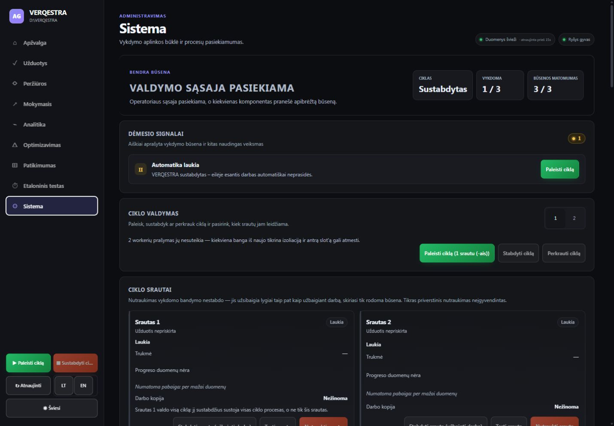

### 7. Mobili apžvalga — 🟢

60 px antraštė palieka turiniui 92,9 % viewport'o; kortelės persirikiuoja be horizontalaus lūžio.

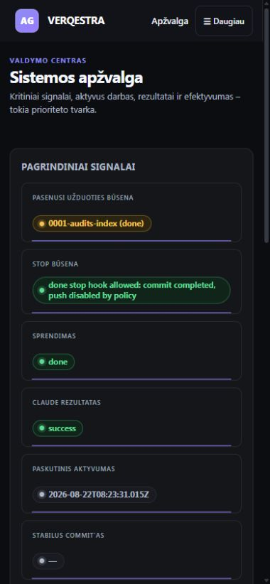

### 8. Mobili užduočių lenta — 🟡/🟢

Vieno stulpelio išdėstymas aiškus ir skaitomas. Prieinamumo rizika yra 1 × 1 px fokusavimo grandinėje paliktas failo input'as.

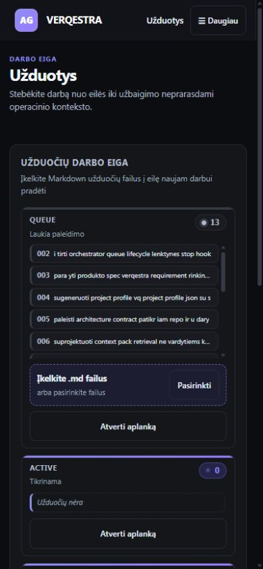

### 9. Mobilus „Daugiau“ meniu — 🟡

Meniu pilnas ir turi matomą fokusavimo kontūrą, tačiau aukštas vidinis slinkimas apsunkina įrankių pasiekimą.

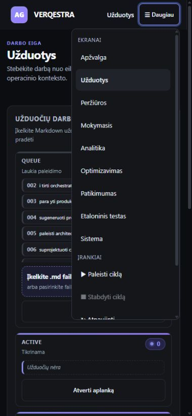

### 10. Analitikos suvestinė — 🟡

KPI hierarchija ir filtrai aiškūs, bet datos formatas bei dalis pagalbinio teksto nelokalizuoti.

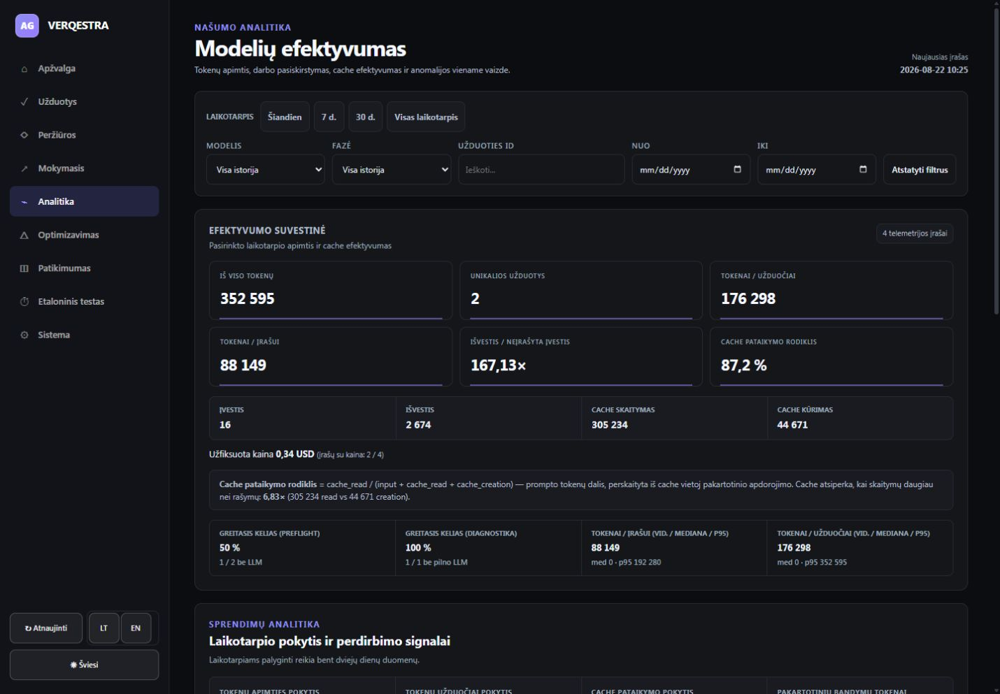

### 11. Užduočių tokenų lentelė — 🟠

Rikiuojama lentelė ir santraukos kortelės skaitomos, tačiau tuščia antra užduotis iškreipia unikalių užduočių skaičių ir vidurkį.

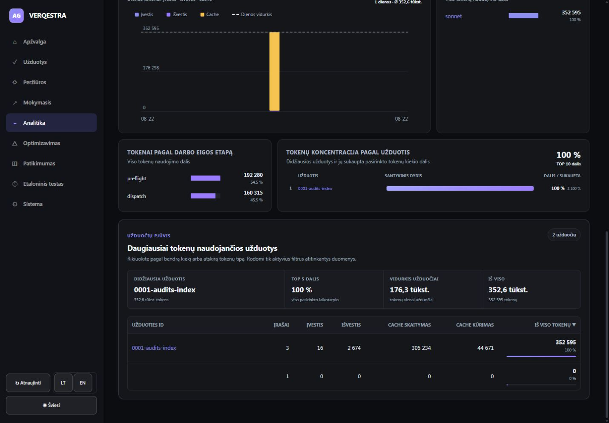

## Prieinamumo ribos

Tai nėra pilnas WCAG auditas. Patikrinta matoma semantinė struktūra, prieinami valdiklių pavadinimai, responsive reflow, keli fokusavimo signalai ir taikinių geometrija. Neatliktas visas klaviatūros maršrutas su visomis būsenomis, testas konkrečiu ekrano skaitytuvu, 200–400 % didinimas ar formalūs spalvų kontrasto skaičiavimai. Būseną keičiantys veiksmai nebuvo aktyvuoti.

## Rekomenduojama taisymo seka

1. Suvienodinti politikų eilės skaičius ir grupuoti pasikartojančius pasiūlymus.
2. Pašalinti tuščią analitikos užduotį iš KPI vardiklio arba aiškiai ją įvardyti.
3. Sutvarkyti failo įkėlimo fokusavimo modelį.
4. Lokalizuoti užduočių būsenas, pavadinimus, datų formatą ir pagalbinius tekstus.
5. Sutankinti mobilų meniu ir subalansuoti apžvalgos signalų tinklelį.
