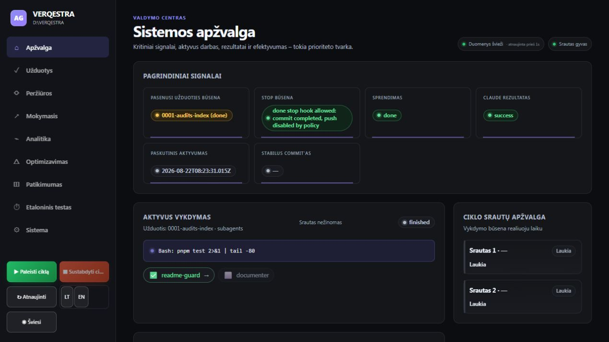
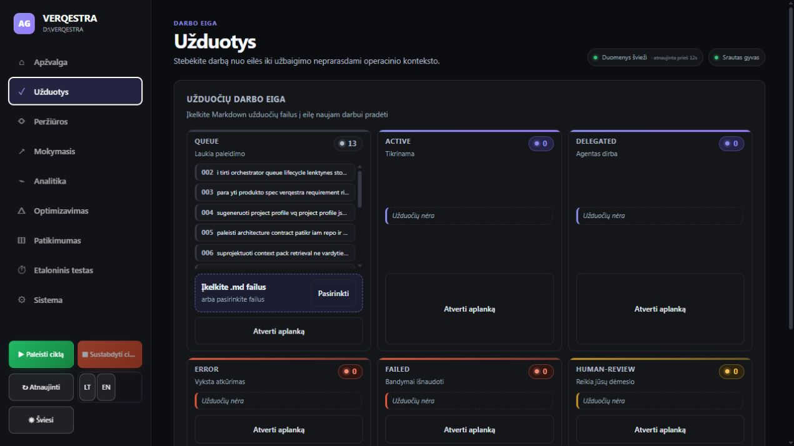
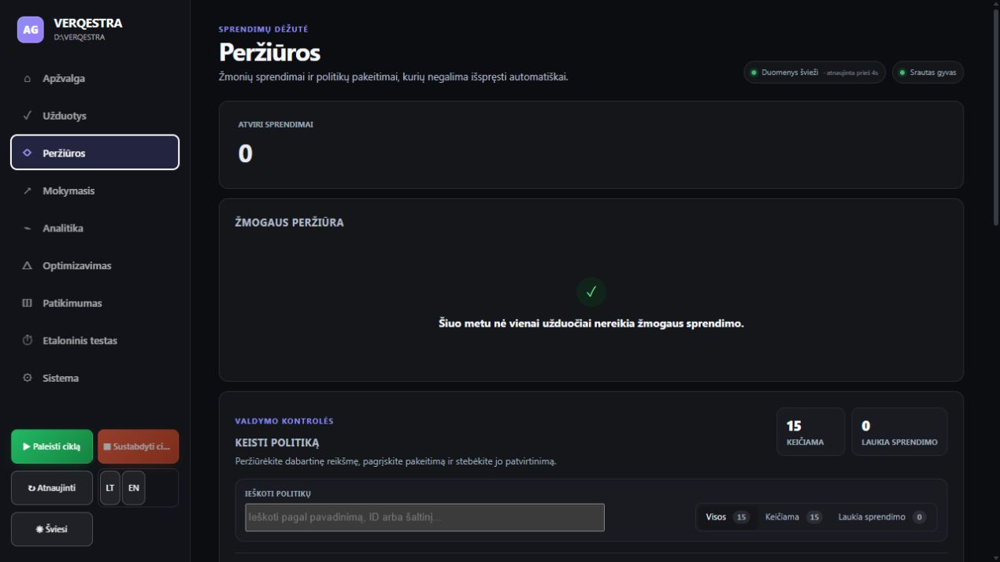
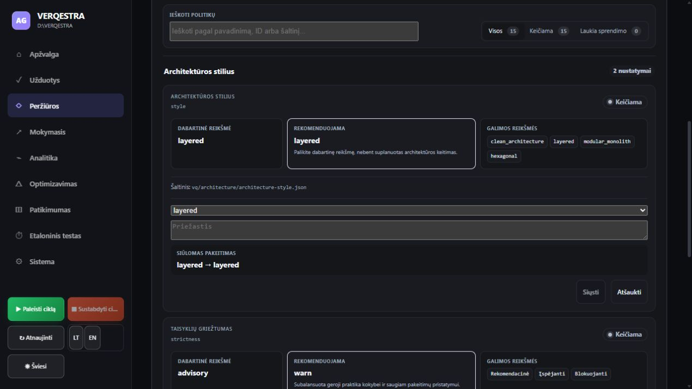
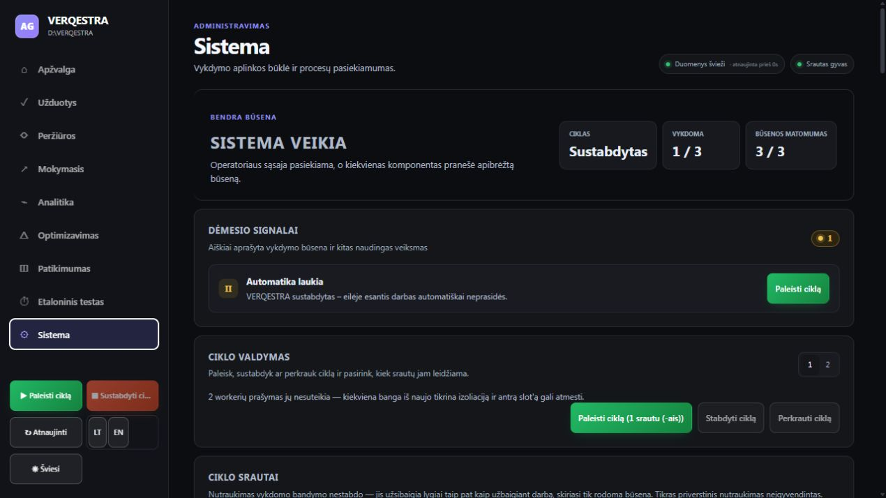
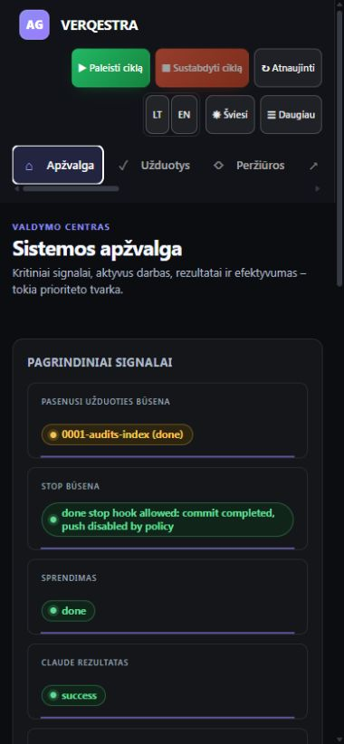
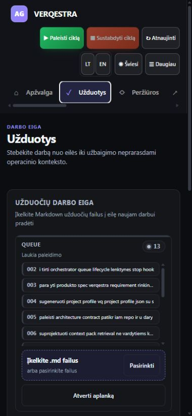
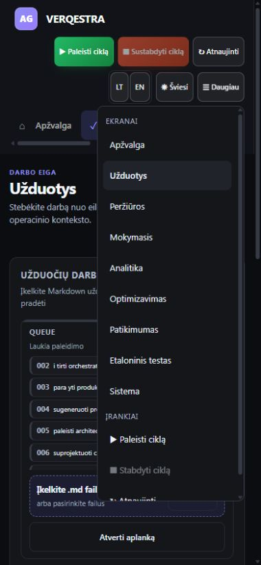

# VERQESTRA UI auditas — 2026-08-24 (pakartotinis)

## Santrauka

**Bendra būklė: 🟡 6,5/10.** Pagrindiniai ekranai veikia, naršymas stabilus, konsolėje tikrintame sraute klaidų neužfiksuota, o mobili užduočių lenta persirikiuoja į vieną stulpelį. P0 blokatorių nerasta. Didžiausia likusi rizika — operatoriui nepakankamai aiškiai atskiriama sąsajos/duomenų ryšio būsena nuo realios automatikos būsenos.

Auditas atliktas dabartiniame vietiniame build'e, esant sustabdytam ciklui, 13 užduočių eilėje ir 0 atvirų žmogaus sprendimų. Tikrinti 1440 × 1000 ir 390 × 844 viewport'ai. Nebuvo paleistas ciklas, įkeliami failai ar siunčiami politikų pakeitimai.

## Prioritetinės išvados

### P1 — Bendra būklė komunikuojama dviprasmiškai

Visuose ekranuose rodoma žalia žyma „Srautas gyvas“, o sistemos ekranas tuo pat metu rodo „Ciklas — Sustabdytas“, „Vykdoma — 1 / 3“ ir dėmesio signalą „Automatika laukia“. Antraštė „Sistema veikia“ yra techniškai paaiškinta kaip pasiekiama operatoriaus sąsaja, tačiau vizualiai ji nustelbia svarbesnę žinią, kad automatinis darbas neprasidės.

**Poveikis:** operatorius gali supainioti gyvą būsenos/ryšio srautą su veikiančiu darbo ciklu.

**Rekomendacija:** atskirti tris statusus: „Sąsaja pasiekiama“, „Būsenos ryšys prijungtas“ ir „Automatika sustabdyta“. Pagrindinę antraštę parinkti pagal operacinį pasirengimą, pvz. „Ribotai veikia — automatika sustabdyta“.

### P1 — Mobilioji lipni antraštė užima 27,3 % aukščio

390 × 844 viewport'e lipni antraštė yra 230 px aukščio. Logotipas, trys ciklo valdikliai, kalba, tema, „Daugiau“ ir horizontali navigacija užima daugiau nei ketvirtį ekrano prieš prasidedant puslapio turiniui.

**Poveikis:** trumpame ekrane pagrindinė informacija matoma mažoje zonoje, o ilguose operaciniuose ekranuose naršymas ir skenavimas reikalauja daugiau slinkimo.

**Rekomendacija:** palikti vieną 56–64 px lipnią juostą su logotipu, aktyviu ekranu ir „Daugiau“; ciklo veiksmus perkelti į išskleidžiamą meniu arba kontekstinę apačios juostą.

### P2 — Tuščia peržiūrų būsena nustumia pagrindinį politikų darbą

Kai atvirų sprendimų nėra, didelė „Žmogaus peržiūra“ kortelė užima didžiąją pirmo ekrano dalį. Politikų paieška ir keitimo srautas prasideda tik žemiau matomos ribos.

**Rekomendacija:** tuščią būseną sumažinti iki kompaktiško 48–72 px patvirtinimo pranešimo, o politikų valdymą pakelti aukščiau.

### P2 — Užduočių pavadinimai ir būsenos maišo kalbas

Lietuviškoje sąsajoje stulpeliai lieka „QUEUE“, „ACTIVE“, „DELEGATED“, „ERROR“, „FAILED“, „HUMAN-REVIEW“, o keli pavadinimai praranda lietuviškus simbolius, pvz. „i tirti“, „para yti“, „u daryti“.

**Poveikis:** lėtesnis skenavimas ir mažesnis pasitikėjimas duomenų tikslumu.

**Rekomendacija:** rodomus stulpelių pavadinimus lokalizuoti, o užduoties antraštę imti iš Markdown metaduomenų ar turinio, ne iš nuvalyto failo slug'o.

### P2 — Politikos forma nepaaiškina, kodėl veiksmas išjungtas

Atidarius formą pradinė būsena rodo „layered → layered“, „Siųsti“ yra išjungtas, o pasirinkimas ir priežastis vizualiai neturi nuolatinių laukų etikečių — priežastis komunikuojama tik placeholder'iu.

**Rekomendacija:** neleisti pasirinkti dabartinės reikšmės kaip pakeitimo arba aiškiai rodyti „Pasirinkite kitą reikšmę“; prie pasirinkimo ir priežasties pridėti matomas etiketes bei trumpą reikalavimų tekstą.

### P2 — Dalies mobilių taikinių plotis mažesnis nei 44 px

Pamatuoti kalbos mygtukai yra 27 × 44 px ir 30 × 44 px. Tai padidina netikslaus paspaudimo riziką, ypač kai jie yra greta.

**Rekomendacija:** kiekvienam taikiniui skirti bent 44 × 44 CSS px arba užtikrinti lygiavertę vidinę/paspaudžiamą zoną.

## Kas jau veikia gerai

- Užduočių lenta darbalaukyje turi aiškią 3 stulpelių struktūrą, o siaurame ekrane persirikiuoja į vieną stulpelį.
- Mobiliajame ekrane svarbiausi valdikliai matomi, o „Daugiau“ meniu leidžia pasiekti visus ekranus ir įrankius.
- Sistemos ekranas turi konkretų dėmesio signalą ir tiesioginį kitą veiksmą „Paleisti ciklą“.
- Būsenos perteikiamos tekstu, ne vien spalva; navigacija ir pagrindiniai veiksmai turi prasmingus prieinamus pavadinimus.
- Tikrintų perėjimų metu naršyklės konsolėje klaidų ir įspėjimų neužfiksuota.

## Ekranų eiga

### 1. Apžvalga — 🟡

Kritiniai signalai pateikti pirmi, tačiau „Srautas gyvas“ semantiškai per arti vykdymo būsenos, o smulkūs antriniai užrašai ir techninės reikšmės sunkiau skenuojami.

### 2. Užduotys — 🟡/🟢

Stulpelių tankis darbalaukyje valdomas, queue sąrašas turi savo slinktį ir neprailgina visos kortelės. Didžiausi trūkumai čia yra lokalizacija ir pavadinimų kokybė.

### 3. Peržiūros — 🟡

Tuščia žmogaus peržiūros būsena yra aiški, bet per didelė pagal savo informacinę vertę ir nustumia politikų valdymą žemiau pirmo ekrano.

### 4. Politikos pasiūlymas — 🟡

Forma telpa į kortelę ir aiškiai parodo dabartinę bei rekomenduojamą reikšmę. Trūksta matomų laukų etikečių ir išjungto veiksmo paaiškinimo.

### 5. Sistema — 🟠

Dėmesio signalas ir ciklo valdymas yra geri operaciniai komponentai. Tačiau pagrindinė „Sistema veikia“ žinia konfliktuoja su sustabdytu ciklu ir 1 / 3 vykdomų procesų.

### 6. Mobili apžvalga — 🟡

Kortelės persirikiuoja be horizontalaus turinio lūžio, bet 230 px lipni antraštė smarkiai sumažina darbinę erdvę.

### 7. Mobili užduočių lenta — 🟡/🟢

Vieno stulpelio lenta yra gerokai lengviau skaitoma nei suspausta kanban struktūra. Queue kortelė ir failų įkėlimo zona išlaiko aiškią hierarchiją.

### 8. Mobilus „Daugiau“ meniu — 🟡

Meniu suteikia prieigą prie visų ekranų ir įrankių, tačiau yra aukštas, turi vidinę slinktį ir dubliuoja dalį jau matomos horizontalios navigacijos.

## Prieinamumo ribos

Tai nėra pilnas WCAG auditas. Patikrinta matoma semantinė struktūra, būsenų tekstai ir mobilių taikinių geometrija. Neatliktas end-to-end testas su konkrečiu ekrano skaitytuvu, visas klaviatūros fokusavimo maršrutas, didinimas iki 200–400 % ar formalūs spalvų kontrasto skaičiavimai. Destruktyvūs ir būseną keičiantys veiksmai nebuvo aktyvuoti.

## Rekomenduojama taisymo seka

1. Atskirkite ryšio, sąsajos ir automatikos būsenas bei perrašykite sistemos hero žinutę.
2. Sumažinkite mobilią lipnią antraštę iki vienos kompaktiškos juostos.
3. Sumažinkite tuščią peržiūrų kortelę ir pakelkite politikų valdymą.
4. Sutvarkykite užduočių lokalizaciją bei pavadinimų šaltinį.
5. Pridėkite formos etiketes, išjungto veiksmo paaiškinimą ir ≥44 × 44 px mobilius taikinius.
