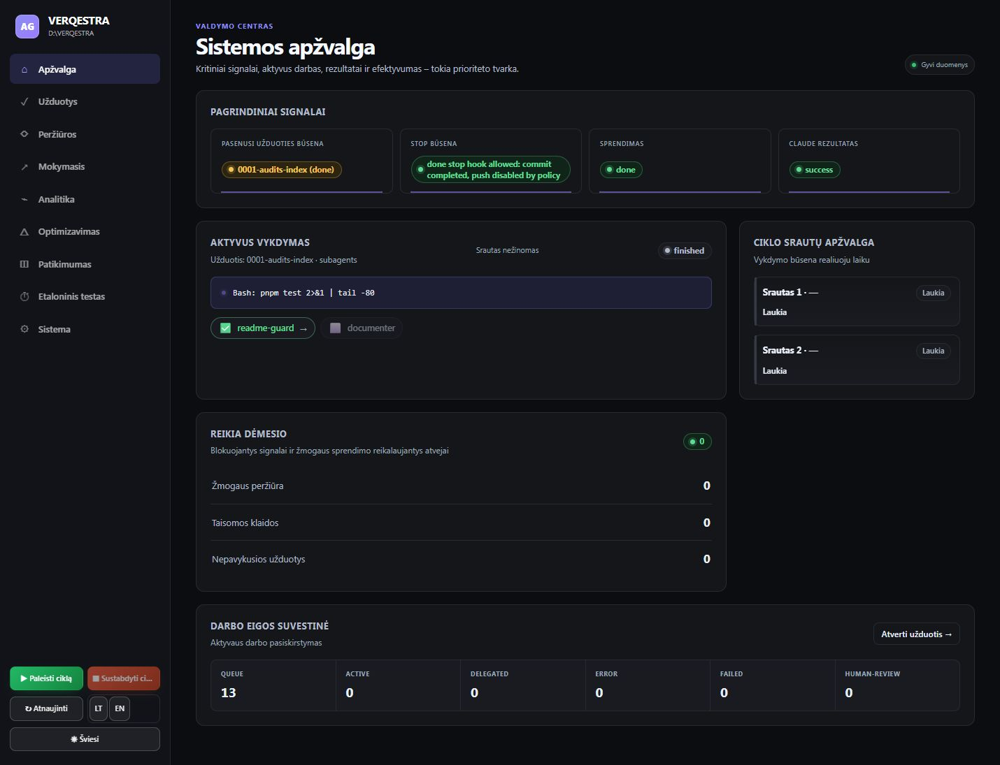
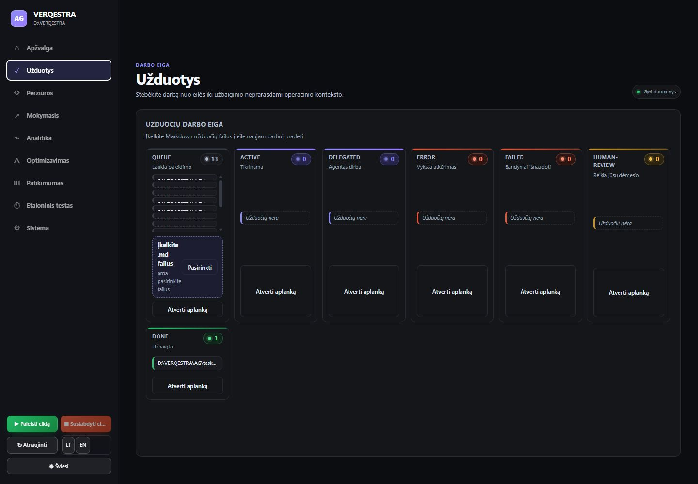
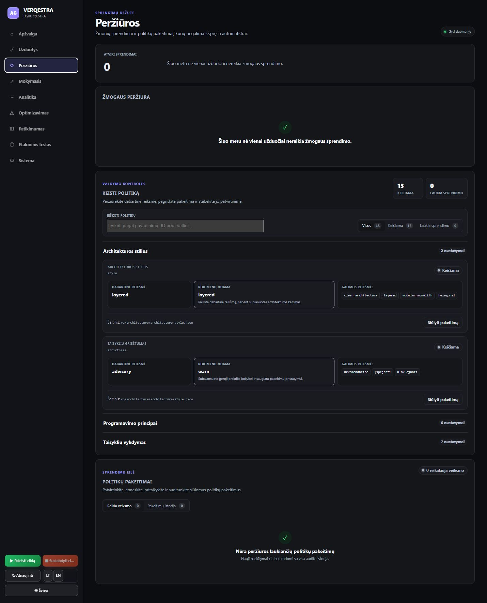
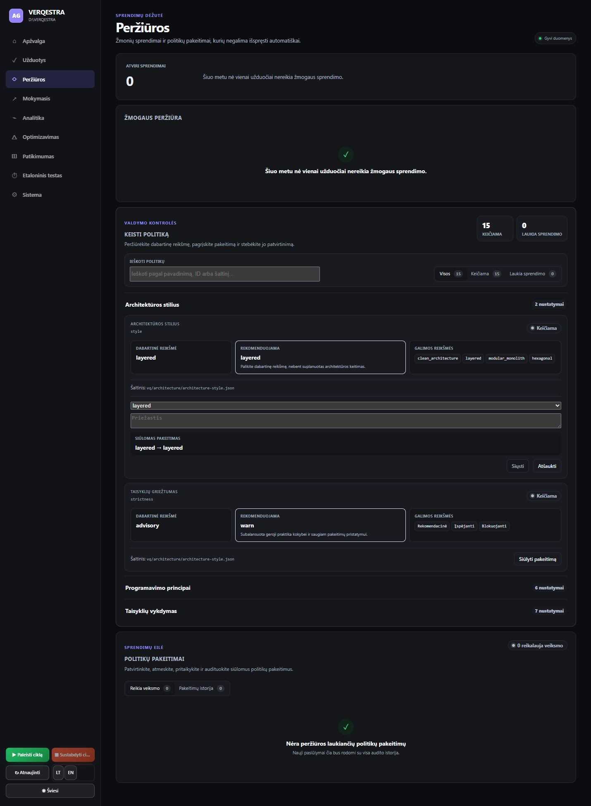
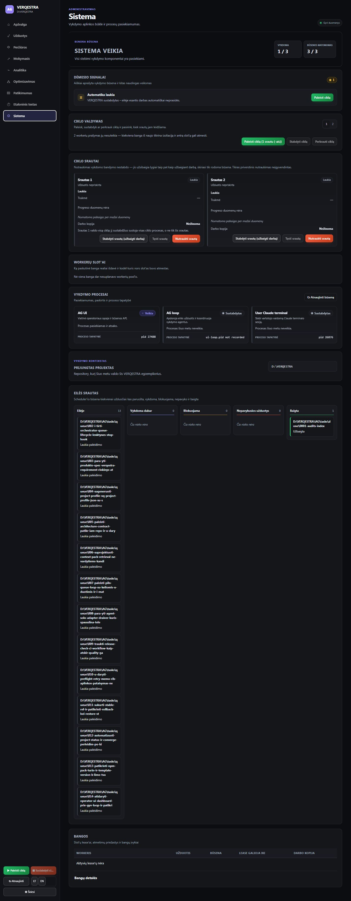
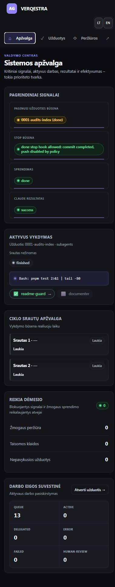
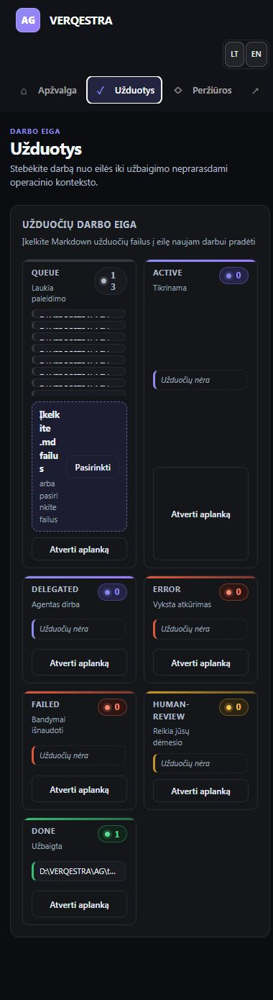

# VERQESTRA UI auditas — 2026-08-24

## Verdiktas

**Veikia ir yra gerokai sustiprintas, bet dar ne paruoštas be išlygų.** Ankstesnis P0 paleidimo
gedimas pašalintas: visi pagrindiniai ekranai atsidaro be konsolės klaidų. Informacijos hierarchija,
semantinė struktūra ir saugių veiksmų būsenos daug kur geros. Didžiausi likę trūkumai yra būsenų
pasitikimumas, užduočių lentos skaitomumas ir siauro ekrano valdymas.

## Audito apimtis

- Produktas: vietinis VERQESTRA operatoriaus dashboard.
- Srautas: Apžvalga → Užduotys → Peržiūros → politikos forma → Sistema.
- Dydžiai: 1440 × 1000 ir 390 × 844.
- Režimas: kombinuotas UX ir prieinamumo auditas.
- Mutuojantys veiksmai, ciklo paleidimas, stabdymas ir politikos pateikimas nebuvo vykdomi.

## Žingsniai ir sveikata

1. **Apžvalga — gera su pasitikėjimo rizika.** Pagrindiniai signalai, vykdymas, dėmesio blokas ir
   eilės suvestinė turi aiškią prioritetų tvarką. Tačiau „Gyvi duomenys“ rodomi greta „Pasenusi
   užduoties būsena“, todėl bendras šviežumo pažadas yra per platus.
2. **Užduotys — reikia taisyti.** Darbalaukyje šeši stulpeliai per stipriai suspaudžia eilės įrašus
   ir įkėlimo bloką. Siaurame ekrane dviejų stulpelių išdėstymas laužo žodžius bei paslepia failų
   pavadinimų prasmę.
3. **Peržiūros — gera.** Aiškus sprendimų skaičius, paieška, filtrai, rekomenduojamos reikšmės ir
   atskira audito eilė. Tris kartus kartojama ta pati nulinė būsena sukuria nereikalingą vertikalų
   plotą.
4. **Politikos forma — gera.** Forma atsidaro tame pačiame kontekste, turi susietas etiketes,
   aiškų pakeitimo palyginimą ir išjungtą „Siųsti“, kol nėra realaus pakeitimo bei priežasties.
5. **Sistema — vidutinė.** Veiksmai ir proceso detalės išsamūs, bet „Sistema veikia / visi
   komponentai pasiekiami“ konfliktuoja su „1/3 vykdoma“, sustabdytu ciklu ir dėmesio signalu.
   Neaktyviems, tuštiems srautams vis tiek siūlomi „Stabdyti“ ir „Nutraukti“ veiksmai.
6. **Siaura apžvalga — gera su funkcijų praradimu.** Kortelės persirikiuoja tvarkingai, tačiau
   ciklo veiksmai, atnaujinimas, tema ir šviežumo indikatorius dingsta, o horizontaliai slenkanti
   navigacija neturi aiškios užuominos.
7. **Siauros užduotys — prasta.** Dviejų stulpelių lenta 390 px pločio ekrane yra per ankšta;
   įkėlimo tekstas lūžta beveik po raidę, o failai tampa neatskiriami.

## Stiprybės

- Pagrindinis turinys turi `main`, navigacija turi pavadinimą, ekranai ir svarbūs blokai turi
  nuoseklias antraštes bei regionus.
- Aktyvus navigacijos punktas perduodamas ne vien spalva, o ir `aria-current` būsena.
- Būsenų spalvas beveik visur lydi tekstiniai pavadinimai ir skaičiai.
- Rizikingi bendro ciklo veiksmai įprastoje sustabdytoje būsenoje išjungiami nuosekliai.
- Politikos keitimo forma aiškiai rodo „buvo → bus“ ir neleidžia siųsti tuščio pasiūlymo.
- Visame patikrintame sraute nebuvo neapdorotų konsolės klaidų.

## UX rizikos

### P1 — būsenų pažadai prieštarauja vieni kitiems

- Apžvalga rodo „Gyvi duomenys“, nors pirmas signalas yra „Pasenusi užduoties būsena“.
- Sistema teigia „Sistema veikia“ ir „visi komponentai pasiekiami“, nors tik 1 iš 3 procesų veikia,
  ciklas sustabdytas ir rodomas dėmesio signalas.
- Operatorius turi pats nuspręsti, kuri žinutė yra autoritetinga. Tai ypač rizikinga prieš ciklo
  paleidimą ar gedimo diagnozę.

### P1 — užduočių lenta suspaudžia svarbiausią turinį

- Darbalaukyje daug tuščių stulpelių gauna tiek pat pločio, kiek 13 įrašų turinti eilė.
- Failų vardai sutrumpinami iki beveik vienodų brūkšnelių; matomas visas absoliutus kelias, nors
  operatoriui svarbiausia užduoties ID ir pavadinimas.
- Siaurame ekrane dviejų stulpelių tinklelis paliekamas per ilgai ir įkėlimo tekstas tampa
  praktiškai neskaitomas.

### P1 — sistemos ekranas per ilgas ir kartoja eilės informaciją

- „Eilės srautas“ ištempia visą ekraną pagal ilgiausią stulpelį ir palieka didžiulius tuščius
  plotus kituose stulpeliuose.
- Ta pati eilė jau yra atskirame „Užduotys“ ekrane; sistemos ekrane pakaktų suvestinės ir nuorodos.
- Tuštiems srautams rodomi aktyvūs stabdymo bei nutraukimo mygtukai, nors nėra priskirtos užduoties.

### P2 — per daug nulinių būsenų peržiūrų ekrane

„Atviri sprendimai 0“, atskiras tuščias „Žmogaus peržiūra“ blokas ir tuščia politikų eilė kartu
užima daug vietos. Viena bendra rami suvestinė leistų greičiau pasiekti politikos kontrolę.

## Prieinamumo rizikos

- Siaurame ekrane matomi navigacijos mygtukai yra apie 39 px aukščio, kalbos mygtukai 35 px, o
  keli užduočių veiksmai 32–38 px. Tai mažiau už rekomenduojamą 44 × 44 px paspaudimo taikinį.
- Horizontaliai slenkanti navigacija vizualiai nenurodo, kad dešinėje yra dar penki ekranai.
- Siaurame ekrane svarbūs ciklo, atnaujinimo ir temos veiksmai paslepiami be alternatyvaus meniu.
- Lietuviškoje politikos formoje prieinami laukų pavadinimai dalinai lieka angliški
  („Architecture style ...“), todėl ekrano skaitytuvo kalba nėra nuosekli.
- „Pereiti prie turinio“ valdiklis DOM struktūroje yra, bet šio naršyklės valdymo būdu nepavyko
  patikimai patikrinti jo fokusavimo ir fokusavimo žiedo.

## Rekomendacijos

1. **P1:** pakeisti bendras būsenas į tikslias: atskirti „duomenų ryšys aktyvus“ nuo kiekvieno
   šaltinio šviežumo, o sistemai naudoti „Reikia dėmesio“, kai sustabdyti būtini komponentai.
2. **P1:** užduočių lentoje rodyti trumpą ID ir pavadinimą, pilną kelią palikti `title` ar detalių
   rodinyje; tuščius stulpelius siaurinti arba suskleisti.
3. **P1:** iki maždaug 700 px užduočių kategorijas rodyti vienu stulpeliu ar skirtukais, o įkėlimo
   bloką iškelti virš lentos per visą plotį.
4. **P1:** siaurame antraštės variante pridėti aiškų „Daugiau“ meniu, kuriame būtų visi ekranai,
   atnaujinimas, tema ir saugiai pateikti ciklo veiksmai.
5. **P1:** išjungti srauto „Stabdyti“ ir „Nutraukti“, kai ciklas sustabdytas arba srautas neturi
   užduoties; paaiškinti priežastį šalia valdiklio.
6. **P2:** sistemos eilės blokui nustatyti maksimalų aukštį, virtualizuoti ar rodyti tik pirmus
   kelis įrašus su nuoroda į „Užduotys“.
7. **P2:** padidinti mobilių interaktyvių elementų aukštį bent iki 44 px ir pakartoti klaviatūros,
   screen reader, 200 % zoom bei tikslaus spalvų kontrasto patikras.

## Įrodymų ribos

- Iš ekranų negalima patvirtinti pilnos WCAG atitikties.
- Klaviatūros fokusavimo seka dėl naršyklės valdymo apribojimo nebuvo patikimai atkuriama.
- Ciklo paleidimas, stabdymas, failų įkėlimas ir politikos pateikimas nebuvo vykdomi, kad auditas
  nekeistų projekto būsenos.
- Neaudituoti atskiri „Mokymasis“, „Analitika“, „Optimizavimas“, „Patikimumas“ ir etaloninio testo
  srautai; jie buvo už apibrėžto pagrindinio operatoriaus kelio ribų.

## Ekranai

