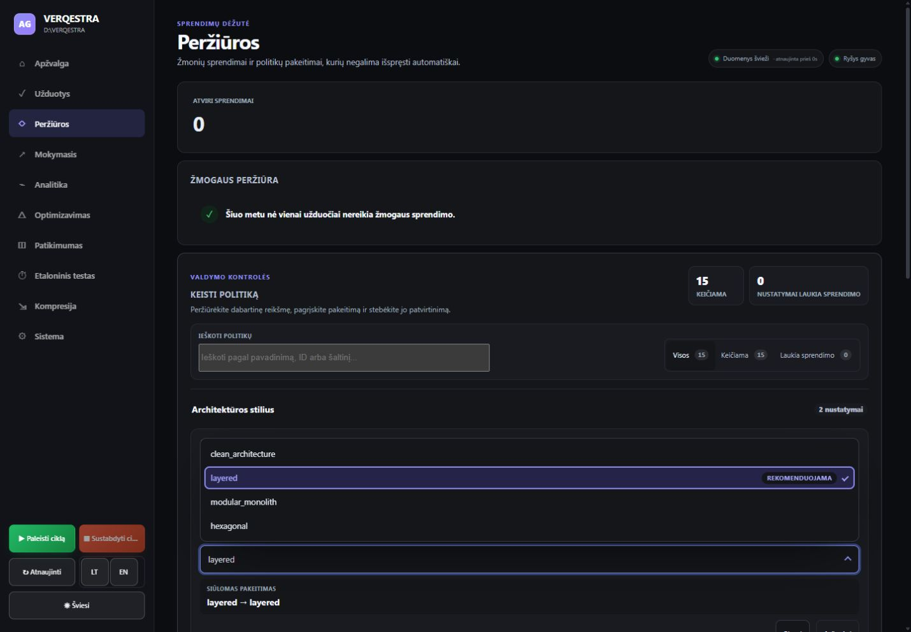
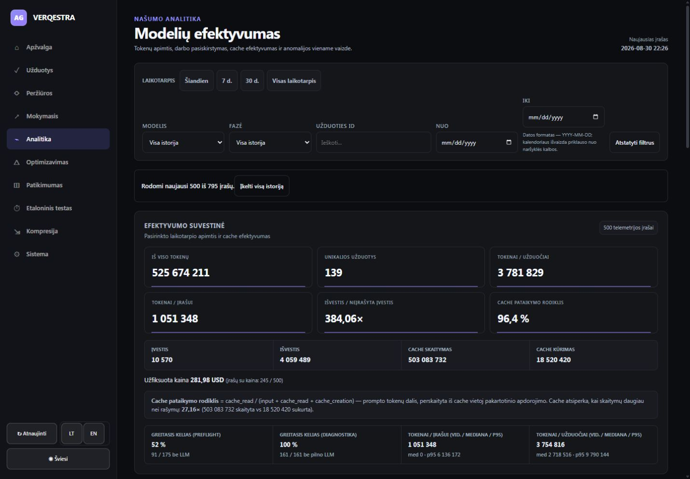
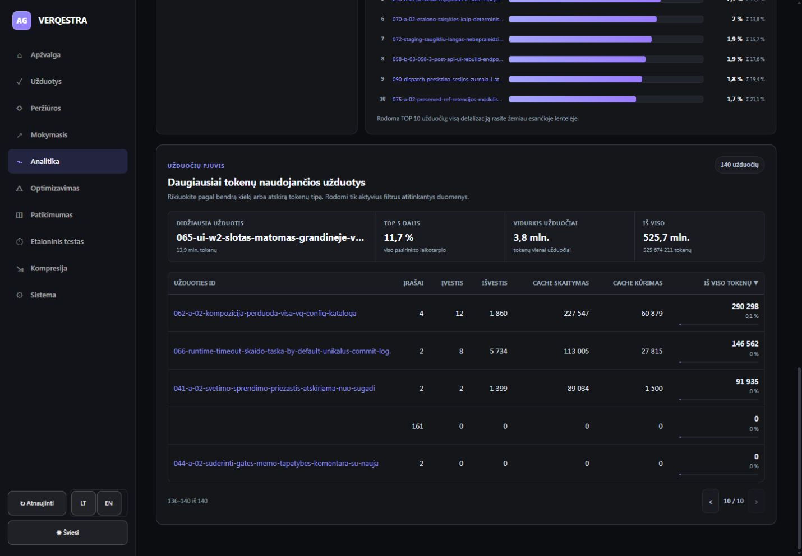
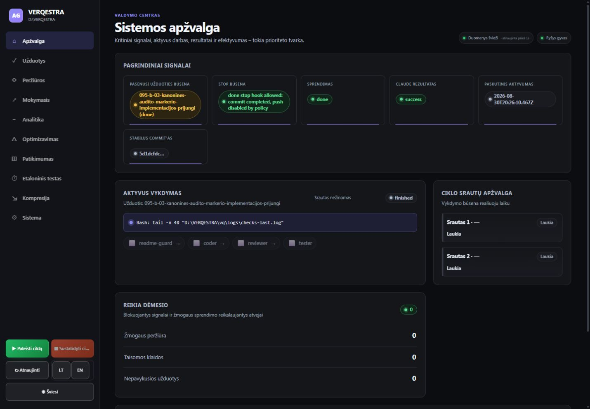
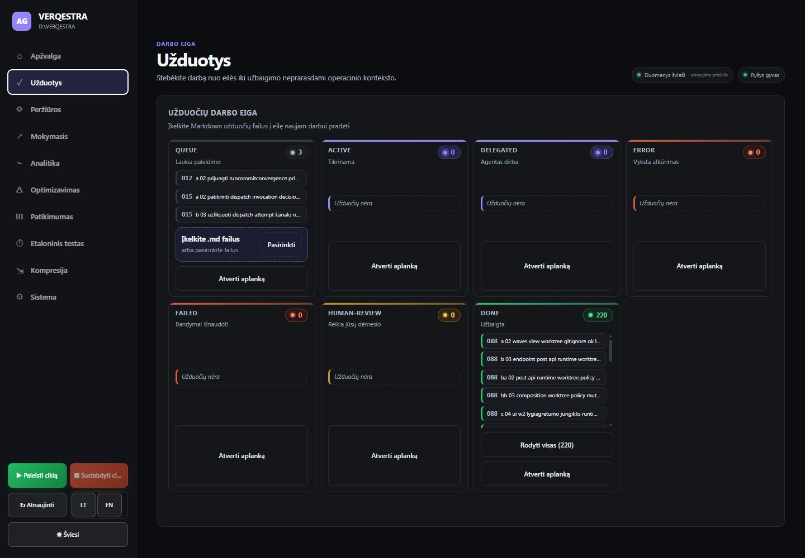
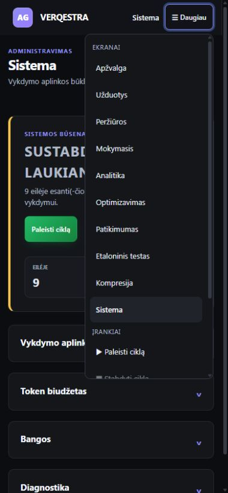
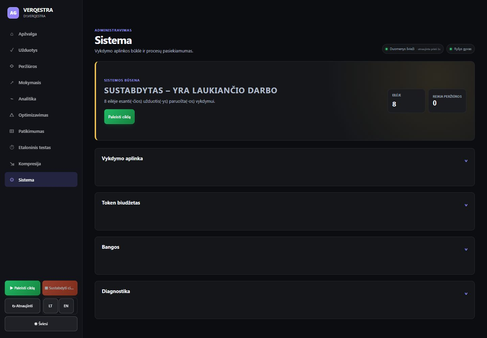
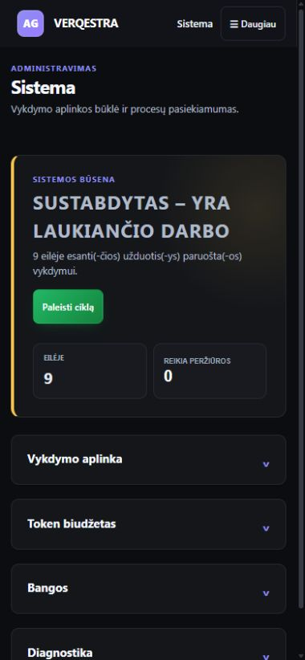
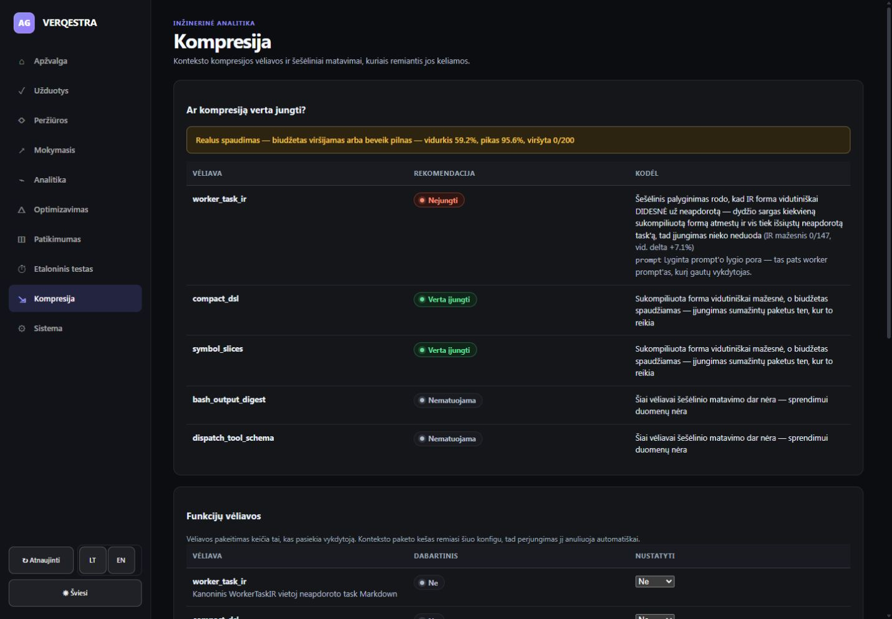
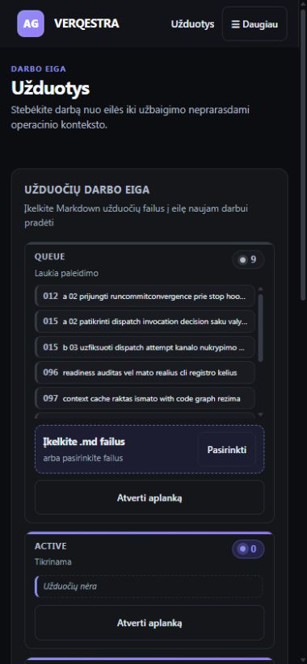

# VERQESTRA UI auditas po atnaujinimų

Audito laikas: 2026-08-31–2026-09-01  
Peržiūros dydžiai: 1440 × 1000 ir 390 × 844  
Tikrinimo būdas: naujai perrinktas Vite paketas, vietinė gyva API, in-app Chromium naršyklė  
Verdiktas: **reikia pataisymų prieš release**

## Santrauka

Atnaujinta versija vizualiai ir struktūriškai stipriai pagerėjo. Sistemos ekranas tapo trumpa, aiškia suvestine su išskleidžiamomis sekcijomis; 390 px plotyje nebeliko viso puslapio horizontalaus persipildymo. Užduočių lenta gerai prisitaiko mobiliame ekrane, dideli sąrašai ribojami ir turi atskirą „Rodyti visas“ veiksmą. Analitika aiškiai įspėja, kad iš pradžių rodomi tik naujausi 500 iš 795 įrašų, turi puslapiavimą, o Kompresijos ekranas sprendimą susieja su realiais matavimais.

Release vis dar blokuoja trys dalykai: pilnas UI build vartas nepraeina, politikos forma leidžia siųsti pakeitimą nepakeitus reikšmės, o Analitika tą patį rinkinį skaičiuoja kaip 139 ir 140 užduočių.

## Radiniai pagal prioritetą

### P0 — `pnpm --dir ui-app build` nepraeina

Pilnas produkcinis UI build sustoja TypeScript fazėje:

- `src/i18n/coverage.test.ts`: neranda `node:path` ir `node:url`;
- `src/model/apiEnvelopes.test.ts`: neranda `node:path` ir `node:url`;
- `src/view/components/dashboard-css-coverage.test.ts`: neranda `node:path` ir `node:url`.

`ui-app/node_modules/@types/node` nėra tiesioginės priklausomybės vietoje (yra tik `.ignored_node`), o `tsconfig.app.json` įtraukia visą `src`, įskaitant testus. Atskiras `vite build` pavyko ir būtent jo paketas buvo audituotas, tačiau tai apeina projekto deklaruotą `tsc -b && vite build` vartą.

Rekomendacija: pridėti `@types/node` prie `ui-app` devDependencies ir aiškiai įtraukti Node tipus testų konfigūracijoje arba atskirti aplikacijos ir testų TypeScript konfigūracijas. Release vartas turi praeiti standartine komanda.

### P1 — Politikos forma leidžia siųsti `layered → layered`

Atidarius „Siūlyti pakeitimą“, pradinis pasirinkimas sutampa su dabartine reikšme. Peržiūra rodo `layered → layered`, tačiau „Siųsti“ mygtukas lieka aktyvus. Tai leidžia kurti beprasmius valdymo įrašus ir didina dubliuotų pasiūlymų riziką.

Rekomendacija:

- UI lygyje išjungti „Siųsti“, kol nauja reikšmė nesiskiria nuo dabartinės;
- šalia mygtuko parodyti paaiškinimą „Pasirinkite kitą reikšmę“;
- serverio pusėje taip pat atmesti no-op pasiūlymą;
- esamus to paties `failas + nustatymas + siūloma reikšmė` pasiūlymus grupuoti arba deduplikuoti.

Teigiamas aspektas: naujas pasirinkimo valdiklis turi `role="combobox"`, `aria-expanded`, `aria-controls`, `aria-activedescendant` ir `listbox/option` semantiką.

### P1 — Analitika nesutaria dėl užduočių skaičiaus

Tame pačiame 500 įrašų rinkinyje rodoma:

- `UNIKALIOS UŽDUOTYS: 139`;
- viršutinė metrika `TOKENAI / UŽDUOČIAI: 3 781 829`;
- paskirstymo metrika `TOKENAI / UŽDUOČIAI (VID.): 3 754 816`;
- lentelės suvestinė `140 užduočių`;
- paskutiniame lentelės puslapyje yra tuščio ID eilutė su `161` įrašu ir `0` tokenų.

Taigi tuščio `task_id` grupė patenka į lentelę ir vieną vidurkį, bet nepatenka į unikalių užduočių kortelę. Tai paaiškina 139/140 ir skirtingus vidurkius.

Rekomendacija: prieš visas agregacijas naudoti vieną normalizavimo taisyklę. Tuščią ID arba atmesti visur, arba visur rodyti kaip „Nepriskirta“, tačiau jo negalima skirtingai traktuoti to paties ekrano KPI.

### P2 — Apžvalga „aktyviu vykdymu“ vadina užbaigtą būseną

Apžvalgoje sekcija vadinasi „Aktyvus vykdymas“, tačiau joje kartu rodoma `finished`, `Srautas nežinomas`, paskutinė užduotis jau yra `done`, o agentų grandinės žingsniai lieka nepažymėti. Tai atrodo kaip vykstantis darbas, nors faktinė būsena užbaigta.

Rekomendacija: kai vykdymas `finished`, pervadinti sekciją į „Paskutinis vykdymas“, paslėpti neaktualią srauto etiketę ir aiškiai atskirti užbaigtos grandinės rezultatą nuo aktyvaus progreso.

### P2 — LT režime vis dar lieka mišrios produkto etiketės

Užduočių stulpeliai rodomi kaip `queue`, `active`, `delegated`, `error`, `failed`, `human-review`, `done`. Kituose ekranuose lieka `worker`, `lease`, `prompt`, `canary`, `dispatch`, `default` ir kitos angliškos etiketės.

Dalis jų yra tikri techniniai identifikatoriai ir gali likti originalūs, tačiau dabar kodinis ID ir vartotojo būsena atrodo vienodai. Lokalizuotinas būsenas verta versti, o nekintamus identifikatorius vizualiai žymėti kaip kodą.

### P2 — Puslapio pavadinimas nėra pagrindinis `H1`

Patikrintuose ekranuose vienintelis `H1` yra prekės ženklas `VERQESTRA`, o aktyvaus puslapio pavadinimas (`Užduotys`, `Sistema`) yra `H2`. Ekrano skaitytuvo antraščių navigacijoje tai silpnina orientaciją.

Rekomendacija: prekės ženklą pateikti kaip nuorodą arba neutralų elementą, o kiekvieno maršruto pavadinimą padaryti vieninteliu `H1`.

### P3 — LT datos laukai vis dar rodo `mm/dd/yyyy`

Analitikos formoje naršyklės datos laukai LT režime vizualiai rodo `mm/dd/yyyy`, o pagalbinis tekstas nurodo `YYYY-MM-DD`. Paaiškinimas apie naršyklės kalbą yra naudingas, bet du vienu metu matomi formatai atrodo prieštaringai.

### P3 — Mobilus meniu turi antrą slinkimo zoną

390 × 844 ekrane meniu turinys yra 757 px aukščio, o matoma jo dalis — 589 px (`overflow-y: auto`). Temos, kalbos ir dalis įrankių lieka žemiau pirmo vaizdo. Funkciškai meniu veikia, tačiau 10 ekranų ir įrankiai viename sąraše jau peržengia kompaktiško mobiliojo meniu ribą.

Rekomendacija: dažniausius ekranus palikti viršuje, retesnius sugrupuoti į 2–3 sekcijas, o temą ir kalbą sutraukti į atskirą nustatymų eilutę.

## Kas pagerėjo ir veikia gerai

- **Sistemos responsive išdėstymas sutvarkytas.** 390 px peržiūroje `scrollWidth = 380`, kai `innerWidth = 390`; net išskleidus „Bangos“ viso puslapio horizontalus slinkimas neatsirado.
- **Sistema tapo skenuojama.** Viršuje rodoma viena aiški būsena, eilės ir peržiūros skaičiai, o detalės perkeltos į keturias išskleidžiamas sekcijas.
- **Dideli sąrašai ribojami.** Užduočių `done` stulpelyje rodoma trumpa ištrauka ir „Rodyti visas (220)“; Analitikos lentelė turi 15 eilučių puslapius ir įvardytus „Ankstesnis/Kitas puslapis“ mygtukus.
- **Dalinis Analitikos rinkinys nebėra nutylimas.** Aiškiai rodoma „naujausi 500 iš 795“ ir pateiktas „Įkelti visą istoriją“ veiksmas.
- **Failo įkėlimo fokusas sutvarkytas.** Paslėptas `input[type=file]` turi `tabIndex=-1`, `pointer-events:none`; fokusas paliekamas matomam „Pasirinkti“ mygtukui.
- **Kompresijos ekranas paaiškina sprendimą.** Kiekvienai vėliavai pateikta rekomendacija ir priežastis, nematuotos būsenos nerodomos kaip nulis.
- **Pagrindinė semantika gera.** `html lang="lt"`, yra `header`, `nav` ir `main`; nerasta neįvardytų mygtukų ar paveikslų be `alt`.
- **Naršyklės diagnostika švari.** Audito metu nebuvo `console error` ar `warning` įrašų.
- **UI testai praėjo.** `65` failai, `652` testai praėjo, `1` testas praleistas.

## Ekranų sveikata

| Ekranas | Būsena | Esmė |
|---|---|---|
| Apžvalga | Reikia dėmesio | Stipri signalų hierarchija, bet užbaigtas vykdymas pateikiamas kaip aktyvus. |
| Užduotys desktop | Gera su lokalizacijos skola | Aiški lenta, ribotas didelis sąrašas, sutvarkytas failo fokusas. |
| Peržiūros / politikos forma | Reikia pataisymo | Gera ARIA semantika, bet leidžiamas no-op pasiūlymas. |
| Analitika | Kritinė duomenų nuoseklumo rizika | 139/140 ir du skirtingi vidurkiai tam pačiam rinkiniui. |
| Sistema desktop | Gera | Aiški suvestinė ir progresyvus detalių atskleidimas. |
| Kompresija | Gera | Sprendimai aiškiai paremti telemetrija. |
| Sistema mobile | Gera | Ankstesnis horizontalus persipildymas ištaisytas. |
| Mobilus meniu | Priimtina, bet tanku | Veikia, tačiau reikalauja vidinio slinkimo. |
| Užduotys mobile | Gera | Viena kolona, nėra horizontalaus slinkimo, svarbiausi veiksmai matomi. |

## Audito ribos

- Auditas buvo skaitomas: ciklas nepaleistas, failai neįkelti, politikos pasiūlymai nesiųsti, netaikyti ir neatšaukti.
- Patikrinti 1440 × 1000 ir 390 × 844 dydžiai in-app Chromium naršyklėje.
- Tai nėra pilnas WCAG atitikties auditas: nebuvo atliktas išsamus kontrasto matavimas, visų klaviatūros kelių ir ekrano skaitytuvų testas ar kelių naršyklių palyginimas.
- Audito metu gyva eilė kito, todėl užduočių skaičiai tarp atskirų ekrano kopijų gali skirtis; UX išvados remiasi konkretaus ekrano vidiniu nuoseklumu.
